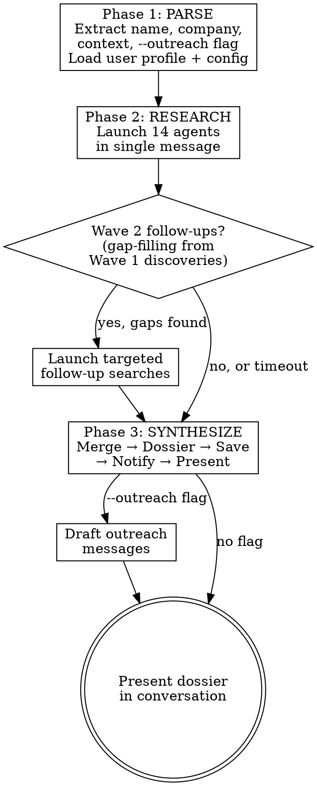

# /networker - Deep Person Intelligence

## Overview

Deep person intelligence through 14 parallel research agents. Produces a structured dossier that answers: who is this person, what do they care about, what do they need, how do I reach them, what do I say, and when do I say it.

**Core principle:** Understand the human before you pitch the business. Every data point serves one goal -- making the first real conversation feel like a reunion, not an introduction.

## When to Use

- Preparing to meet someone for the first time
- Evaluating a prospect or potential partner
- Building a connection strategy for a specific person
- Pre-call research before a sales conversation
- Deepening an existing but shallow relationship
- Any time you need to understand a person beyond their LinkedIn headline

**When NOT to use:** For company-only research (pair with a separate company-dossier skill). For batch lead lists (pair with a separate outreach-sequencing skill). For people you already know deeply.

## Scope & Ethics

This skill researches **publicly-available information only** -- LinkedIn, Crunchbase, news, press releases, company websites, academic profiles, public social media, government contract databases, SEC filings. It does NOT scrape authenticated sources, bypass paywalls, fabricate personal details, or guess at non-public information.

**Use responsibly:**
- For legitimate professional networking, sales preparation, partnership evaluation, and relationship-building.
- Not for stalking, harassment, doxxing, or building profiles on private individuals.
- Respect that some targets are digitally private *on purpose* -- that's a signal to slow down, not to dig harder.
- Never repeat inferred-but-unconfirmed personal details (net worth, nationality, family) as fact. The dossier uses explicit confidence markers for a reason.

If a target is a minor, a private individual with no public professional profile, or someone who has explicitly asked not to be researched -- stop.

## First-Time Setup

Networker is a framework. Personal context stays on your machine. Before first use:

1. **Copy config template:**
   ```bash
   cp config.template.yaml config.yaml
   # Edit config.yaml — set output_dir, local_search_paths, notification preference
   ```
2. **Copy user profile template:**
   ```bash
   cp library/user-profile.template.md library/user-profile.md
   # Edit library/user-profile.md — describe yourself, your company, your network, your value prop
   ```
3. **Verify dependencies:** WebSearch and WebFetch tools must be available. (Agent 4 uses Grep/Glob on your local files.)

Both `config.yaml` and `library/user-profile.md` are gitignored -- they never leave your machine.

At skill-invocation time, the runtime reads both files and substitutes the template variables below (`{{USER_NAME}}`, `{{USER_COMPANY}}`, `{{USER_LOCATION}}`, `{{USER_VALUE_PROP}}`, `{{USER_NETWORK_NOTES}}`) throughout the prompts before dispatching agents.

## Input Format

```
/networker <Person Name> <Company> [optional context] [--outreach]
```

**Parsing rules:**
- First 2-4 words = person name (supports compound names like "Anne-Sophie Martin")
- Next word(s) = company name (supports multi-word like "Horizon Materials Corp")
- Remaining text = optional context hints (focus areas, meeting timing, relationship goals)
- `--outreach` flag = also draft 2-3 personalized messages at the end

**Examples:**
```
/networker Jane Smith Acme
/networker Jane Smith Acme Corp --outreach
/networker Alex Rivera OpenAI focus on her AI safety research and Stanford connections
/networker Marie Dupont BioTech I'm meeting her at JPM next week --outreach
```

## Pipeline



---

## Phase 1: PARSE & LOAD

1. Extract `PERSON_NAME`, `COMPANY`, `CONTEXT_HINTS`, `OUTREACH_FLAG` from input.
2. Read `config.yaml` -- resolve `output_dir`, `local_search_paths`, `notification` block. If `config.yaml` is missing, fall back to sane defaults (output to `~/Documents/person-intel/`, no local search, no notification) and note this in the final GAPS section.
3. Read `library/user-profile.md` -- extract `{{USER_NAME}}`, `{{USER_COMPANY}}`, `{{USER_LOCATION}}`, `{{USER_VALUE_PROP}}`, `{{USER_NETWORK_NOTES}}`. If the file is missing, fall back to a generic "the user" persona and skip Agent 4 (local knowledge) and Agent 9 (social path) -- they need user context to produce meaningful output.
4. Generate name variations for search:
   - Full name: `"First Last"`
   - Name + company: `"First Last" {Company}`
   - Name + title guesses: `"First Last" CEO OR COO OR founder OR CTO`
   - Reversed name (for East-Asian name orderings): `"Last First"`
5. Generate company variations (short form, full legal form, common abbreviations).
6. Pass all variations + substituted user context to agent prompts.

---

## Phase 2: RESEARCH

Launch ALL 14 agents in a single message. No sequential dependencies between agents.

### Agent Prompt Template

Every agent receives this preamble:

```
TARGET: {PERSON_NAME}
COMPANY: {COMPANY}
CONTEXT: {CONTEXT_HINTS or "None provided"}
NAME VARIATIONS: {list}
COMPANY VARIATIONS: {list}
USER CONTEXT: {{USER_NAME}}, {{USER_COMPANY}}, based in {{USER_LOCATION}}. Value prop: {{USER_VALUE_PROP}}.

Your task: {agent-specific goal}

RULES:
- Use WebSearch and WebFetch extensively. Try 5+ different search queries.
- Include URLs for every claim.
- Mark confidence: HIGH (multiple sources), MEDIUM (single source), LOW (inferred).
- If you find nothing, say so explicitly. Do not fabricate.
- Public sources only. Do not attempt to bypass paywalls or authenticated content.
- Return findings in the structured format below.
```

---

### Agent 1: Person Background

**Goal:** Professional history, career arc, achievements, patents, publications.

**Search queries to try:**
- `"{name}" "{company}" LinkedIn`
- `"{name}" "{company}" career OR background OR biography`
- `"{name}" CEO OR COO OR founder OR CTO "{company}"`
- `"{name}" speaker OR keynote OR conference OR podcast OR interview`
- `"{name}" patent OR publication OR "Google Scholar"`
- `site:crunchbase.com "{name}"`
- `site:theorg.com "{name}"`

**Extract:**
- Full career timeline with dates, titles, companies
- Career velocity analysis (how fast did they advance?)
- Education (degrees, honors, programs, graduation years)
- Patents (USPTO, Google Patents, EPO)
- Published academic work (Google Scholar, ResearchGate)
- Awards and recognition
- Salary band estimates per role (use industry benchmarks, mark as LOW confidence)
- Professional certifications
- Media appearances (podcasts, interviews, conference talks)
- All quotes attributed to them (verbatim)

---

### Agent 2: Company Intelligence

**Goal:** Full company profile -- products, funding, team, market, hiring, supply chain.

**Search queries to try:**
- `"{company}" funding OR "Series A" OR "Series B" OR raised`
- `"{company}" founder OR founded OR co-founder`
- `site:crunchbase.com "{company}"`
- `site:techcrunch.com "{company}"`
- `"{company}" hiring OR careers OR "open roles"`
- `"{company}" customers OR partnerships OR case study`
- `"{company}" glassdoor OR reviews OR culture`
- `"{company}" competitor OR versus OR alternative`
- `site:sam.gov "{company}"` (US government contracts)
- `site:sbir.gov "{company}"` (SBIR/STTR awards)

**Extract:**
- Company overview (what they do, one paragraph)
- Founding date, location, employee count
- Funding history (rounds, amounts, lead investors, dates)
- Product line with descriptions
- Hiring velocity (count current open roles, categorize by function)
- Customer list (inferred from press releases, logos, case studies)
- Supplier chain clues (what do THEY buy?)
- Competitor comparison matrix
- Government contracts and grants
- Glassdoor sentiment summary
- Tech stack (from job listings, BuiltWith)
- Board members and advisors with backgrounds

---

### Agent 3: Inner Circle & Life Trajectory

**Goal:** Map the target's publicly-documented close relationships and trace how they shaped major career decisions.

**Search queries to try:**
- `"{name}" co-founder OR "met" OR "worked together"`
- `"{co-founder names}" background OR career OR education`
- `"{name}" mentor OR advisor OR "early career"`
- `"{company}" "founding story" OR "origin" OR "how it started"`

**Extract (publicly documented only):**
- Co-founder relationship: how they met, timeline, complementary skills
- Mentor/early boss identification (from interviews and public profiles)
- Falling out analysis (any co-founders or early team publicly departed?)
- Public immigration/relocation timeline (from press bios, not inferred)
- Life decision trace tree (from published interviews, not speculation):
  ```
  Why this city? → [quoted evidence]
  Why this industry? → [quoted evidence]
  Why this co-founder? → [quoted evidence]
  Why leave previous job? → [quoted evidence]
  ```

**Do NOT research:** Family members who have no professional/public profile, spouses/children unless publicly discussed by the target themselves, private addresses or personal contact info.

---

### Agent 4: Local Knowledge Base

**Goal:** Search `{{USER_NAME}}`'s existing files, notes, and pipeline for existing connections to the target.

**Search locations** (from `config.yaml` → `local_search_paths`). Typical entries:
- Your CRM exports or pipeline CSVs
- Your dossier archive (`~/Documents/person-intel/` or similar)
- Your knowledge base / notes / Obsidian vault
- Your email export folder
- Your customer reports
- Any prior conversation memory files

**Search terms:**
- Target person's name (and variations)
- Company name (and variations)
- Industry keywords
- City/location keywords

**Extract:**
- Existing customer or partner relationship? (order history, email count, sentiment)
- Named in any pipeline or target list?
- Any prior dossiers or reports on this person?
- Email correspondence (count, tone, topics, last interaction date)
- Calendar history (past meetings)
- Competitor overlap (do we serve their competitors?)

**If `local_search_paths` is empty or unset:** Skip this agent. Flag in GAPS section: "No internal intelligence -- paths based on external data only."

---

### Agent 5: Ecosystem & Industry

**Goal:** Map the industry landscape, cross-geography bridges between `{{USER_LOCATION}}` and the target's location, and networking infrastructure around the target.

**Search queries to try:**
- `"{industry}" ecosystem OR hub OR cluster "{target city}"`
- `"{industry}" {{USER_LOCATION}} connection OR bridge`
- `"{industry}" conference OR event {current year} {next year}`
- `"{industry}" supply chain OR bottleneck OR shortage`
- `"{industry}" regulation OR export control OR compliance`
- `"{industry}" podcast OR newsletter OR community`
- `"{company}" university OR research OR academic partner`
- `"{industry}" government program`

**Extract:**
- Industry landscape (key players, market size, growth)
- Geographic bridges between {{USER_LOCATION}} and the target's location
- Event calendar (next 12 months, with dates and cities)
- Industry communities (Slack, Discord, associations)
- Influential podcasts and newsletters in the space
- Academic collaboration map
- Government program managers funding the space
- Supply chain crisis points (bottlenecks {{USER_COMPANY}} could solve)
- Regulatory environment (ITAR, export controls, compliance needs)

---

### Agent 6: Social & Digital Presence

**Goal:** Map publicly-visible social media activity, posting patterns, engagement network, and digital persona.

**Search queries to try:**
- `"{name}" site:twitter.com OR site:x.com`
- `"{name}" site:linkedin.com`
- `"{name}" site:instagram.com` (public accounts only)
- `"{name}" site:github.com`
- `"{name}" site:medium.com OR site:substack.com`
- `"{name}" "{company}" blog OR article OR post`

**Extract (public content only):**
- Platform inventory (which platforms, handles, follower counts)
- Posting frequency and pattern (daily? quarterly? milestone-only?)
- Content themes (what do they post about?)
- Engagement analysis (who likes/comments? any notable figures?)
- Content they engage WITH (likes, comments, shares -- reveals hidden interests)
- Tone evolution (early posts vs recent)
- Professional photo signals (corporate headshot vs casual vs team)
- Hashtags and topics followed
- GitHub/technical contributions (if any)
- Newsletter subscriptions (do they write or subscribe to any?)

---

### Agent 7: Deep Personal Enrichment

**Goal:** Origin, nationality, schooling, alumni networks, cultural identity (from public sources only).

**Search queries to try:**
- `"{name}" site:rocketreach.co OR site:zoominfo.com OR site:signalhire.com`
- `"{name}" school OR university OR graduated OR alumni`
- `"{name}" "{country}" OR hometown`
- `"{name}" scholarship OR fellowship OR honor`
- `"{name}" "{university}" club OR society`

**Extract (from publicly-documented sources):**
- Secondary school (often a strong origin signal -- e.g., elite national schools reveal nationality)
- University details (clubs, societies, honors programs, study abroad)
- Nationality / citizenship (confirmed from bio or inferred with explicit confidence level)
- Language capabilities (inferred from schooling, cultural background -- mark LOW confidence)
- Alumni network overlap with {{USER_NAME}}'s network (if known)
- Professional diaspora networks (mentioned in bios, never inferred from name alone)
- Scholarship/financial background signals (from public bios)

**Do NOT infer:** Religion, political views, family wealth, or immigration status from name/appearance alone. Only from self-disclosed public sources.

---

### Agent 8: Location Intelligence

**Goal:** Determine publicly-confirmed physical location, movement patterns, and next likely location.

**Search queries to try:**
- `"{name}" "{company}" location OR based OR "lives in" OR office`
- `"{name}" conference OR speaking OR attending {current year}`
- `"{name}" keynote OR panel OR speaker {next year}`
- `"{company}" headquarters OR office "{city}"`

**Extract (public sources only):**
- Primary location (city, country) with confidence level and evidence
- Secondary location(s) with evidence
- Travel patterns (inferred from conference speaking history, public check-ins)
- Upcoming confirmed locations (conference speaker listings, event RSVPs)
- Next likely location with date estimate
- Timezone inference from public posting timestamps

**Do NOT research:** Property records, home addresses, real-time location tracking, fitness app check-ins at private addresses.

---

### Agent 9: Social Path & Proximity

**Goal:** Map degrees of separation between `{{USER_NAME}}` and the target. Engineer legitimate proximity opportunities.

**Use `{{USER_NETWORK_NOTES}}` from library/user-profile.md** to know the user's accelerators, alma maters, investors, past employers, conferences attended, and named connections.

**Search queries to try:**
- `"{name}" "{known user connection}" OR {{USER_COMPANY}}`
- `"{company}" "{user accelerator}" OR "{user program}"`
- `"{name}" investor OR advisor shared with {{USER_COMPANY}} network`
- `"{name}" "{target city}" startup community OR founder network`
- `"{target university}" alumni {{USER_LOCATION}} OR {{USER_COMPANY}}`

**Also search locally** (Grep over `local_search_paths`):
- Shared contacts, shared programs, shared events

**Extract:**
- Connection paths ranked by warmth (HOT → WARM → LUKEWARM → STRATEGIC)
- Each path: the chain of people, relationship strength at each hop, specific intro request draft
- Shared experiences (same accelerator, same conference, same investor, same customer)
- Content engagement strategy (which posts to comment on, what to say, when to DM)
- Event co-attendance plan (3-5 events in next 12 months where both could attend)
- Mutual adversary identification (shared competitors/frustrations)
- Gift/gesture ideas (meaningful, non-generic -- avoid extractive or presumptuous gestures)
- Warm intro script drafts for each viable path

---

### Agent 10: Financial Profile (Professional Context)

**Goal:** Estimate the target's financial context *for the purpose of calibrating outreach* -- grinding founder vs wealthy selective vs institutional exec. Not for surveillance.

**Search queries to try:**
- `"{company}" valuation OR "post-money" OR funding`
- `"{name}" angel investment OR advisor OR board compensation`
- `site:sec.gov "{name}" OR "{company}"` (SEC filings are public)

**Extract:**
- Equity stake estimate (model dilution across funding rounds using standard terms)
- Company valuation estimate (from last round implied post-money)
- Prior compensation bands (industry benchmarks per role -- mark LOW confidence)
- Publicly-disclosed other ventures (angel investments, advisory equity, board seats from LinkedIn/Crunchbase)
- Liquidity assessment (primarily liquid cash vs illiquid startup equity)
- Posture implication: builder-grinding vs wealthy-and-selective vs corporate-exec

**Do NOT research:** Private property records, personal bank accounts, individual tax filings, divorce records, or other materially private financial data.

---

### Agent 11: Friction Map & Aversions

**Goal:** Identify people, companies, ideas, and practices the target has publicly criticized. This prevents you from stepping on a landmine in your first conversation.

**Search queries to try:**
- `"{name}" criticism OR disagree OR disappointed OR frustrated`
- `"{name}" vs OR versus OR "better than" OR "unlike"`
- `"{company}" lawsuit OR dispute OR complaint`
- `"{name}" deleted OR controversial OR backlash`
- `site:web.archive.org "{name}" site:twitter.com` (deleted tweets)
- `"{company}" glassdoor negative OR "cons"`
- `"{name}" "{competitor}" criticism`

**Extract:**
- Competitors/companies they've publicly criticized (with verbatim quotes, intensity rating)
- Industry practices they criticize (with evidence and what it reveals about values)
- Publicly-documented people conflicts (public disagreements, open letters, PACER filings)
- Negative press (search specifically for critical coverage)
- Deleted content (Wayback Machine snapshots)
- Topics to ABSOLUTELY AVOID in conversation (ranked by severity)
- Trigger phrases (specific framings that would alienate them)
- Values hierarchy (rank what they care about most, derived from what they push against)

---

### Agent 12: Communication & Persuasion Profile

**Goal:** Determine exactly how to talk to this person -- tone, format, evidence style, decision framework.

**Analyze** (from Agent 6's social media data + interviews + career pattern):

**Extract:**
- Writing style analysis (LinkedIn posts: short punchy vs long-form? Technical vs accessible?)
- Formality spectrum (do they use "Dear" or "Hey"? Sign off "Best" or just name?)
- Evidence preference (data-driven? Story-driven? Both?)
- Decision-making framework (hypothesis-driven? Data-driven? Mission-driven?)
- Risk tolerance profile (left stable job for startup vs stayed the course)
- Meeting preference (async-leaning? Short calls? In-person?)
- Response time patterns (how quickly do they engage on LinkedIn?)
- Humor style (dry? self-deprecating? technical? absent?)
- Reference frameworks (what analogies resonate? Use THEIR mental models)
- Name preference (full name? Nickname? Cultural ordering?)
- Persuasion approach recommendation:
  ```
  Lead with: [data/story/mission/ROI]
  Message length: [brief/moderate/detailed]
  Tone: [formal/casual/peer-level]
  Key phrase to use: "[specific phrase aligned to their values]"
  Key phrase to AVOID: "[specific phrase that would alienate]"
  ```

---

### Agent 13: Timing & Momentum

**Goal:** Identify the optimal outreach window and momentum signals.

**Search queries to try:**
- `"{company}" announcement OR launch OR news {current year}`
- `"{company}" hiring OR careers site`
- `"{company}" event OR conference OR tradeshow {current year} {next year}`
- `"{company}" quarterly OR annual OR fiscal year`
- `"{name}" recent activity OR latest post`

**Extract:**
- 90-day momentum score: composite of (recent funding + recent hire + recent product launch + recent press) → HIGH/MED/LOW
- Recent company events (funding, product launches, partnerships -- last 6 months)
- Hiring velocity (how many roles, what type, how long listed)
- Product roadmap timing (upcoming launches → procurement windows precede by 3-6 months)
- Board meeting cycle estimate (quarterly for VC-backed → decisions cluster around these)
- Budget/procurement cycle (fiscal year end? government contract cycles?)
- Competitor timing (any competitor announcements creating urgency?)
- Personal timing (recently relocated? New role? Settling vs executing?)
- Conference calendar (upcoming events they'll likely attend)
- Seasonal patterns (industry conference clusters, major holidays including cultural)
- STRIKE WINDOW recommendation: "Reach out [when] because [reason]"

---

### Agent 14: Needs & Pain Points

**Goal:** Identify what the target person and their company need right now -- not just what `{{USER_COMPANY}}` can offer, but what would genuinely help them.

**Search queries to try:**
- `"{company}" hiring OR "looking for" OR "seeking"`
- `"{company}" challenge OR problem OR bottleneck OR struggle`
- `"{company}" glassdoor "cons" OR "management" OR "culture"`
- `"{name}" "looking for" OR "anyone know" OR "recommendations"`
- `"{industry}" shortage OR supply chain OR bottleneck`
- `"{company}" expansion OR scaling OR growth challenges`

**Extract:**
- **Business needs** (what the company needs):
  - Open roles they can't fill (= capability gaps)
  - Supply chain/vendor gaps (inferred from products + industry bottlenecks)
  - Geographic expansion needs
  - Regulatory/compliance gaps
  - Technology gaps (from job listings mentioning tools they don't have)
  - Each with evidence and urgency: CRITICAL / HIGH / MED / LOW

- **Professional needs** (what the person needs in their role):
  - What is their biggest operational challenge right now?
  - What partnerships would accelerate their goals?
  - What expertise are they missing on their team?
  - Each with evidence and how {{USER_NAME}} could help

- **Personal needs** (what the human needs):
  - Community (diaspora network, peer founders, industry peers)
  - Knowledge (areas they're learning about publicly)
  - Transitions (new city, new role, scaling challenges)
  - Each with evidence and how to offer value

- **What {{USER_NAME}} / {{USER_COMPANY}} can uniquely provide:**
  - Match needs to {{USER_VALUE_PROP}}
  - Specific offer formulation (not generic, tailored to their exact need)
  - Non-business value (introductions, community, peer advice)

---

## Wave 2: Follow-Up Triggers

After Wave 1 agents complete, check for gaps that warrant targeted follow-up:

| Wave 1 Discovery | Wave 2 Action |
|-------------------|---------------|
| Agent 7 finds a specific elite school | Agent 9 searches that school's alumni in user's network |
| Agent 8 finds an upcoming conference | Agent 13 checks if user is attending or could attend |
| Agent 3 finds a co-founder name | Agent 11 searches for public friction between co-founders |
| Agent 4 finds existing customer data | Agent 13 adjusts timing based on relationship status |
| Agent 2 finds specific product launch | Agent 14 maps procurement window for that product |
| Multiple agents return thin results | Launch broader name/company variation searches |

**Timeout rule:** If Wave 1 took >5 minutes, skip Wave 2 to avoid excessive wait time.

---

## Phase 3: SYNTHESIZE & DELIVER

### Step 1: Merge Agent Outputs

Compile all agent outputs into the dossier template (see below). Resolve conflicts between agents (e.g., different location claims) by using confidence levels.

### Step 2: Generate Playbook

Using all 14 agent outputs, synthesize:
- Connection strategy (ranked paths with specific actions)
- 3-5 conversation starters (tailored to their values, needs, and current moment)
- Landmine list (things to never say, ranked by severity)
- Timing recommendation (when to reach out and why)
- Value proposition (what you can offer THEM, not what you want)

### Step 3: Draft Outreach (if --outreach flag)

Draft 2-3 messages:
1. **LinkedIn DM** -- peer-level, <100 words, references something specific
2. **Warm intro request** -- email to the intermediary connector
3. **Cold email** -- direct, leads with value, references their specific need

Each draft must:
- Lead with value (what you can do for THEM), not ask
- Reference a specific detail from the dossier (proves you did homework)
- Match the communication style from Agent 12
- Avoid all landmines from Agent 11
- Align with timing from Agent 13

### Step 4: Save Locally

Save to `{config.output_dir}/{slug}.md` where slug = `{lastname}-{company}` in lowercase (e.g., `smith-acme.md`).

Create the directory if it doesn't exist.

### Step 5: Notification (optional)

If `config.yaml` → `notification` is configured, send a condensed summary via the configured channel:

- `notification.type: telegram` -- send via Telegram Bot API using `notification.telegram.bot_token` + `notification.telegram.chat_id`
- `notification.type: slack` -- send via Slack incoming webhook at `notification.slack.webhook_url`
- `notification.type: none` (default) -- skip

**Notification format:**
```
PERSON INTEL: {Name} @ {Company}

{Title} | {Location} | {Origin}
Net worth: {range} | Momentum: {score}

TOP NEED: {their #1 need right now}
BEST PATH: {warmest connection path}
STRIKE WINDOW: {when and why}
LANDMINE: {#1 thing to avoid}

Full dossier: {local path to saved .md file}
```

### Step 6: Present in Conversation

Present the full dossier in conversation with the complete template structure below.

---

## Dossier Output Template

```markdown
# {Person Name} -- Person Intelligence Dossier

**Prepared for:** {{USER_NAME}}, {{USER_COMPANY}}
**Date:** {YYYY-MM-DD}
**Target:** {Person Name}, {Title} @ {Company}
**Classification:** Internal -- Relationship Building

---

## SNAPSHOT

| Field | Detail |
|-------|--------|
| Full name | {name + handles} |
| Title | {current role} |
| Company | {company} ({one-line}) |
| Location | {city, country} (confidence: HIGH/MED/LOW) |
| Origin | {nationality/hometown, confidence marked} |
| Age | {estimate, confidence marked} |
| Net worth | {range} ({liquid vs illiquid}, confidence marked) |
| LinkedIn | {URL} |
| Other socials | {URLs or "None found"} |
| Momentum | {HIGH/MED/LOW} -- {reason} |

---

## 1. CAREER ARC
{Timeline table, velocity analysis, salary bands, patents, publications}

## 2. EDUCATION & INTELLECTUAL PROFILE
{Degrees, honors, selective programs, academic interests}

## 3. INNER CIRCLE & LIFE TRAJECTORY
{Publicly-documented co-founder relationships, mentor chain, life decision trace}

## 4. COMPANY DEEP DIVE
{Products, funding, hiring, customers, suppliers, competitors, government contracts}

## 5. DIGITAL PRESENCE & PERSONALITY
{Platforms, posting patterns, engagement network, tone, content themes}

## 6. LOCATION & MOVEMENT
{Current location, evidence, travel patterns, upcoming events, next likely location}

## 7. FINANCIAL PROFILE
{Equity model, prior comp bands, publicly-disclosed other ventures, posture implication}

## 8. FRICTION MAP
{Dislikes with quotes, public conflicts, topics to AVOID, values from friction}

## 9. COMMUNICATION PLAYBOOK
{How to talk to them: tone, evidence style, frameworks, humor, meeting preference}

## 10. TIMING ASSESSMENT
{Momentum score, product windows, budget cycle, seasonal patterns, STRIKE WINDOW}

## 11. NEEDS ASSESSMENT
{Business needs, professional needs, personal needs, what {{USER_COMPANY}} uniquely provides}

---

## CONNECTION STRATEGY

### Existing Relationship
{From Agent 4: customer status, email history, team interactions, order data}

### Connection Paths (ranked by warmth)
| Tier | Path | Action | Intro Script |
|------|------|--------|-------------|
| HOT | {path} | {action} | {draft} |
| WARM | {path} | {action} | {draft} |
| ... | ... | ... | ... |

### Proximity Plays
{Events, communities, content engagement, shared causes, non-presumptuous gesture ideas}

### Conversation Starters
{3-5 openers tailored to values and current moment}

### Landmines
{Things to never say, ranked by severity}

---

## OUTREACH DRAFTS (if --outreach)

### Draft 1: LinkedIn DM
{<100 words, peer-level, specific reference}

### Draft 2: Warm Intro Request
{Email to connector}

### Draft 3: Direct Email
{Value-led, references their specific need}

---

## GAPS & UNKNOWNS
{What couldn't be found, confidence levels, follow-up actions}

## SOURCES
{All URLs and local files referenced}
```

---

## Error Handling

| Failure | Behavior |
|---------|----------|
| Agents 1-3 (Public Intelligence) ALL fail | Abort. Not enough signal for a useful dossier. Notify user. |
| Any single agent fails | Continue with remaining agents. Note gap in GAPS section. |
| Agent 4 (Local Knowledge Base) fails or `local_search_paths` empty | Continue. Flag: "No internal intelligence -- paths based on external data only." |
| Agent 8 (Location) fails | Default to company HQ location. Mark confidence: LOW. |
| Agent 10 (Financial) fails | Omit section entirely rather than guess with no data. |
| WebSearch unavailable | Fall back to WebFetch on known URLs (LinkedIn, Crunchbase, TheOrg, company site). |
| Notification send fails | Retry once with plain text. If still fails, skip silently and log in GAPS. |
| `--outreach` with insufficient data | Draft only messages where enough context exists. Skip others with explanation. |
| Person not found / too common name | Present disambiguation: "Found N matches -- which one?" with role/company/location for each. |
| Target has near-zero online presence | Lean heavily on Agent 4 (local) and Agent 5 (ecosystem). Flag low confidence throughout. |
| Wave 2 timeout (Wave 1 > 5 min) | Skip Wave 2, proceed to synthesis with Wave 1 data only. |
| Sub-agent rate limit on all parallel launches | Fall back to running research serially from the main conversation. Note in GAPS that Wave 2 was skipped and depth is lower than a full parallel sweep. |

**Core principle:** A partial dossier with clear confidence markers is always better than no dossier. Never fail silently -- always tell the user what's missing and why.

---

## Key Lessons (patterns from field use)

1. **Local knowledge base is often the biggest unlock.** Discovering that a "cold" target is already a current customer, or that a team member has emailed them before, frequently changes the entire strategy from cold outreach to relationship deepening. Always run Agent 4 first-priority when `local_search_paths` is configured.

2. **Secondary school reveals nationality.** Enrichment data showing a specific elite national-feeder high school often pins down origin country when LinkedIn location is ambiguous or misleading. Agent 7's deep enrichment is worth the extra search effort.

3. **The co-founder's backstory explains decisions that look random.** When a target chose an unusual city, industry, or co-founder, the answer is often in the *co-founder's* public history, not the target's. Tracing the inner circle (Agent 3) explains decisions that would otherwise seem random.

4. **Prior-employer overlap is where most co-founders meet.** For almost any target, check employer overlap in the 2-5 years before company founding -- that's usually where co-founders met. Consulting firms (BCG/McKinsey/Bain), big-tech, and elite grad programs are classic co-founder factories.

5. **Infrequent LinkedIn posters are milestone-driven.** If a target posts ~quarterly, they post around company announcements. This means: don't expect fast LinkedIn engagement, but when they DO post, commenting early gets visibility.

6. **The "needs" angle transforms outreach.** Leading with a specific observation about *their* current situation ("I noticed you're hiring 3 supply-chain roles after your Series B") is infinitely more compelling than leading with your own pitch. Agent 14 is the most commercially-valuable agent for outreach prep.

7. **Some people are digitally invisible by design.** If a target has no Twitter, no Facebook, no blog, no personal website, that's a *signal* -- they value privacy, are introverted, or are focused on execution. For these people, Agent 3 (inner circle) and Agent 5 (ecosystem) carry more weight than Agent 6 (social media), and brief peer-to-peer contact beats long cold emails.

8. **Never position as "a platform" to small teams who've been burned by automated vendors.** Many sectors have implicit vocabulary that signals "I understand you" vs "you are a commodity." Agent 12's communication playbook catches these if you've written your value prop well in `library/user-profile.md`.

---

## Dependencies

- **WebSearch + WebFetch:** Required for Agents 1-3, 5-14
- **Grep + Glob:** Required for Agent 4 (local knowledge base)
- **Agent tool:** Required for parallel Wave 1 dispatch
- **Bash:** Required for Phase 3 Step 5 notification (urllib-based HTTP POST)
- **`config.yaml`:** Required for output path, local search paths, and notification config (gitignored)
- **`library/user-profile.md`:** Required for user context substitution into agent prompts (gitignored)
